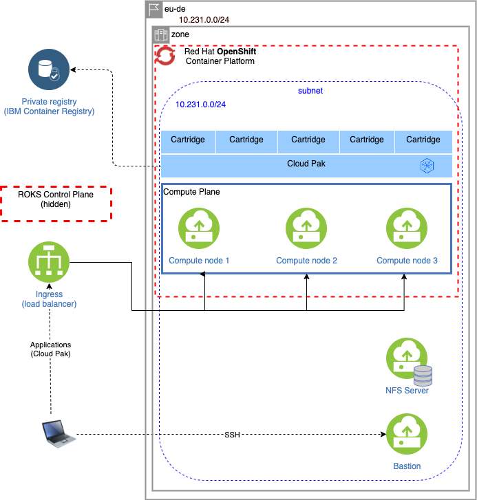

# IBM Cloud ROKS on VPC with NFS storage class and Cloud Pak for Data, using a private registry
This is a sample configuration for ROKS on IBM Cloud, provisioned in a VPC with NFS storage and using a private registry (the IBM Container Registry) on the IBM Cloud. All infrastructure, OpenShift and Cloud Pak for Data are managed by the deployer and deployment requires nothing but an IBM Cloud API key and a Cloud Pak entitlement key. The namespace in the private registry is automatically created as part of the deployment and a service account and API key to pull images will be stored into the vault.

## Infrastructure

### Virtual Private Cloud on IBM Cloud
The Virtual Private Cloud (VPC) contains all of the assets needed that make up this configuration.

### Zones with address prefixes
The sample configuration is made up of 1 availability zone with a netmask of `/24`.

### Subnets
1 subnet is created which spans the entire IP address block and holds the ROKS cluster, the bastion and the NFS server.

### Virtual Server Instances
A bastion is provisioned to serve as a jump host from the internet. It prevents the NFS server from having to have a public IP address. The NFS server can only be reached by using the bastion as the jump host and with the SSH private key that is provisioned too.

The NFS server provides the back-end storage for the `managed-nfs-storage` storage class in OpenShift. Due to throughput limitations and the fact that NFS cannot serve true block storage, not all cartridges support this storage type. Please check the cartridge in question before you install to determine if NFS is supported. By default a 1 TB volume is with a throughput of 10k IOPS is added to the NFS server.

## IBM Container Registry
Images will be pulled from the specified namespace in the IBM Container Registry. If the Cloud Pak entitlement key is configured, images will be mirrored to the private registry namespace.

## OpenShift
An OpenShift cluster with the specified version (4.8) is provisioned inside the VPC. In the sample configuration, the `managed-nfs-storage` storage class is created, referencing the NFS server that is provisioned in the VPC.

## Cloud Pak for Data
Cloud Pak for Data 4.0 is installed in OpenShift project `zen-40`, pulling images from the private registry and referencing the NFS storage class in OpenShift.

### Cartridges
The sample configuration holds a list of cartridges which will be installed. You can control whether cartridges will be installed by commenting or uncommenting the appropriate blocks. Please ensure that the cartridge elements are aligned (hyphens must be aligned with hyphens and properties with properties).

By default, the following cartridges will be installed:
* Cloud Pak Foundational Services (is installed as part of the Cloud Pak for Data control plane)
* Cloud Pak for Data control plane (mandatory)
* Watson Studio
* Watson Machine Learning